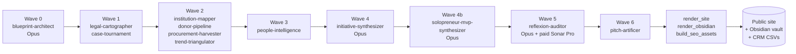

# Central Asia B2G Intelligence

[](https://github.com/avaluev/ca-b2g-research/actions/workflows/quality.yml)
[](https://avaluev.github.io/ca-b2g-research)
[](https://www.apache.org/licenses/LICENSE-2.0)
[](https://github.com/avaluev/ca-b2g-research/releases)

> A typed, source-cited knowledge graph of B2G AI and digital-government opportunities in Uzbekistan and Kyrgyzstan. Every claim is verifiable. Every initiative is mapped to a decree, an institution, a decision-maker, a donor programme, and a global precedent. Output ships as a public site, an Obsidian vault, CRM-ready CSVs, and a strategic memo.

**Live site**: https://avaluev.github.io/ca-b2g-research
**License**: Apache 2.0
**Author**: Alexandr Valuev — [valuev.alexandr@gmail.com](mailto:valuev.alexandr@gmail.com) · [LinkedIn](https://www.linkedin.com/in/avaluev/) · [GitHub](https://github.com/avaluev)
**Cite**: see [CITATION.cff](CITATION.cff)

## Architecture



## Cost and time

- **Wall clock**: ~10 hours per full run.
- **Anthropic Claude**: runs on your own subscription (Opus for waves 0/4/4b/5, Sonnet for the rest).
- **OpenRouter (paid)**: hard cap **USD 20** per run. Used for cross-model verification on Tier-1 LinkedIn URLs (Wave 3) and Tier-A claim re-checks (Wave 5). Free OpenRouter models (Owl Alpha 1M, Gemma 4-31b) handle volume.
- **Per-record output**: 100 decrees, 105 institutions, 117 people, 49 donor programmes, 50 tenders, 61 trends, 100 global cases, 100 B2G initiatives, 200 solopreneur MVPs = **882 typed records**.

## What this is

A multi-agent deep-research harness that turns recent legal, institutional, and funding signals from Uzbekistan and Kyrgyzstan into deployable B2G initiatives. The harness encodes:

- **5+1 analytical lenses** — Karimov→Mirziyoyev Inversion, Japarov Concentration, Decree Half-Life, Donor Co-Financing, Diaspora Bridge, plus Russian/CIS Substitution Window.
- **5-axis scoring rubric** — Speed-to-Contract (25%), Strategic Moat (20%), Defensibility (20%), Capital Access (20%), Russian/CIS Fit (15%).
- **8 typed record types** — Decree, Institution, Person, DonorProgram, Tender, Trend, GlobalCase, Initiative — with foreign-key integrity and verification tags (`VERIFIED`, `L2_VERIFIED`, `INFERRED`, etc.).
- **Hard rules** — no fabricated decree numbers, no fabricated LinkedIn URLs, no English-only sources for country claims, no personal contact details in any output.

## What you'll find

- **`/decrees/`** — Decree atlases for both countries with half-life heat maps.
- **`/institutions/`** — Tier-1-to-8 institution maps (Presidential Admin → Donor PIU).
- **`/donors/`** — Donor pipeline with TTL/PM ↔ government counterpart dyads.
- **`/procurement/`** — Live tenders + win-probability annotations.
- **`/trends/`** — Sector trends with linked decrees + donor programs.
- **`/people/`** — Decision-makers and diaspora bridges (public profiles only).
- **`/initiatives/`** — Top 100+ deployable B2G initiatives, scored on 5 axes, tier-bucketed.
- **`/mvp/`** — Top 100 solopreneur MVP ideas per country (HubSpot $1M Solopreneur MVR framework), bootstrappable in week 1 for $0-$500.
- **`/honesty/`** — Explicit list of what this research did *not* find.
- **`/provenance/`** — Per-record source trail and methodology audit.

## How it was built

The harness ships as a 7-wave parallel agent pipeline:

| Wave | Agent(s) | Role |
|---|---|---|
| 0 | `blueprint-architect` | Strategic plan, target lists, constraint inventory |
| 1 | `legal-cartographer`, `case-tournament` | Decree corpus + 100+ global precedents ranked by transferability |
| 2 | `institution-mapper`, `donor-pipeline`, `procurement-harvester`, `trend-triangulator` | Org taxonomies, donor programs, tenders, sectoral trends |
| 3 | `people-intelligence` | 100+ decision-makers + diaspora bridges |
| 4 | `initiative-synthesizer` | 100+ initiatives, 5-axis scoring (B2G institutional plays, $500K-$10M) |
| 4b | `solopreneur-mvp-synthesizer` | 100+ MVP ideas per country, HubSpot $1M Solopreneur framework ($0-$1M ARR, week-1 launch) |
| 5 | `reflexion-auditor` | Adversarial re-verification, ≥3 HIGH-issue minimum |
| 6 | `pitch-artificer` | Tier-A/B outreach bundles |

Native Claude (Opus + Sonnet) does the heavy reasoning and authoring. OpenRouter (Perplexity Sonar Deep Research, Sonar Pro, o4-mini-deep-research, Owl Alpha, Gemma) provides cross-model verification on Tier-A claims, with a hard $20 budget cap on a per-run basis.

## Reproducing

Prerequisites: Python 3.10+, Claude Code CLI, GitHub account, optional OpenRouter API keys.

```bash
git clone https://github.com/avaluev/ca-b2g-research.git
cd ca-b2g-research
cp .env.example .env  # then fill in OPENROUTER_KEY_* if you have them
make setup            # installs deps, validates agent specs
make run              # full 7-wave pipeline (~10h)
make render           # render CRM + memo + playbook + Obsidian + site
make check-quality    # 12 quality gates over outputs/
make verify-links     # async HEAD-check every URL
```

For a per-wave run:

```bash
bash scripts/run.sh blueprint-architect           # Wave 0
bash scripts/run-parallel.sh wave-1               # Wave 1 (parallel)
# ...
python3 scripts/validate_state.py                 # at every wave boundary
```

## Methodology

This research treats research as infrastructure, not as a document. Every claim is typed (`docs/state_schema.json`), every record carries a verification tag, and every quality gate failure becomes a regression rule (`scripts/check_quality.py`). Source priority is hierarchical:

- **Uzbekistan**: lex.uz, gov.uz, president.uz, norma.uz, spot.uz, gazeta.uz, kun.uz
- **Kyrgyzstan**: president.kg, gov.kg, kabmin.kg, cbd.minjust.gov.kg, 24.kg, kaktus.media, akipress.org
- **Donors**: documents.worldbank.org, projects.worldbank.org, adb.org/projects, ec.europa.eu/international-partnerships, undp.org

Every country claim is cross-referenced against ≥1 Russian-language source, ideally also Uzbek or Kyrgyz native source. English-only research fails the gate.

## Repo layout

```
ca-b2g-research/
├── .claude/agents/             # 11 agent specifications
├── .github/workflows/          # CI: quality, deploy, link-verify
├── docs/                       # state_schema.json, lenses.md, scoring_rubric.md
├── scripts/                    # 15+ Python/bash scripts
├── state/                      # JSON knowledge graph + audit logs
│   ├── decrees/, institutions/, people/, donors/, tenders/, trends/, cases/, initiatives/
│   ├── external/               # OpenRouter evidence cards (provenance trail)
│   ├── audit/                  # quality_report.json, link_report.json, audit_report.md
│   └── knowledge_graph.json    # merged read view
├── outputs/
│   ├── crm/                    # CSV slices
│   ├── memo/strategic_memo.md  # public strategic memo
│   ├── obsidian/               # Obsidian vault (committed, with private outreach gitignored)
│   └── site/                   # public HTML site (built in CI, deployed to gh-pages)
├── README.md, LICENSE, Makefile, pyproject.toml
└── .gitignore, .env.example, CLAUDE.md
```

## Contributing

Apache 2.0. Issues and PRs welcome. New regression rules (something the auditor missed) are especially welcome — the harness improves through use.

## Acknowledgments

Built on Anthropic's Claude (Opus + Sonnet) and OpenRouter's multi-model API gateway. Inspired by the [padel-market-analysis](https://github.com/avaluev/padel-market-analysis) reference architecture.
