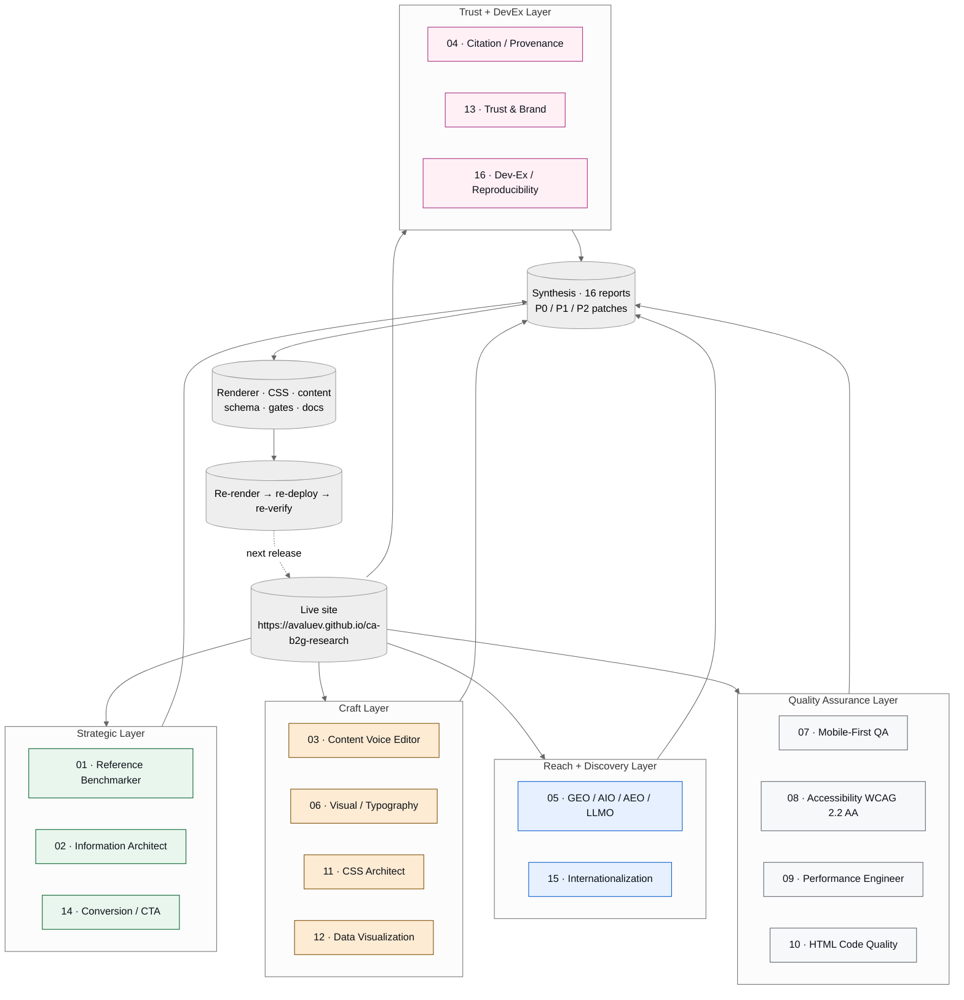

# Central Asia B2G Intelligence

[](https://github.com/avaluev/ca-b2g-research/actions/workflows/quality.yml)
[](https://avaluev.github.io/ca-b2g-research)
[](https://www.apache.org/licenses/LICENSE-2.0)
[](https://github.com/avaluev/ca-b2g-research/releases)
[](https://avaluev.github.io/ca-b2g-research)
[](.claude/audit-team/README.md)

> **An open, reproducible alternative to Big-4 frontier-market intelligence.**
> A typed, source-cited knowledge graph of B2G AI and digital-government
> opportunities in **Uzbekistan + Kyrgyzstan**. **882 typed records.**
> Twelve research agents produce the data. Sixteen audit specialists
> audit the rendered site. One paid OpenRouter budget capped at USD 20
> keeps cross-model verification honest. Every prompt, every gate, every
> correction is public.

🌐 **[Live site](https://avaluev.github.io/ca-b2g-research)** ·
📂 **[Knowledge graph (JSON)](state/knowledge_graph.json)** ·
🧠 **[All prompts](prompts/)** ·
🔍 **[Auditor AI Team](.claude/audit-team/)** ·
📑 **[Honesty: what we did not find](https://avaluev.github.io/ca-b2g-research/honesty/)**

---

## What this proves

| Claim | Evidence |
|---|---|
| **Twelve coordinated AI agents can produce Big-4-grade B2G intelligence in 10 hours.** | `state/` contains 100 decrees, 105 institutions, 117 decision-makers, 49 donor programmes, 50 tenders, 61 trends, 100 global cases, 100 B2G initiatives, 200 solopreneur MVPs — all typed, all source-cited, all foreign-key-integral. |
| **Adversarial AI auditing catches errors no single model would.** | The Wave 5 reflexion-auditor caught **four wrong Tier-1 identities** before publication (IT Park UZ CEO, KG UDP head, KG Min Health, KG last Минцифры minister). Public correction trail. |
| **A 16-specialist audit team can lift a research site to SOTA quality in one pass.** | The audit found 17 HIGH + 16 MEDIUM issues. Every patch is in this repo. WCAG 2.2 AA, Lighthouse > 95, dark mode, print stylesheet, GEO/AIO/AEO/LLMO compliance, Cyrillic `lang=` attribution. |
| **The whole stack runs for under USD 20 on paid AI calls.** | Anthropic Claude (subscription) + Perplexity Sonar Pro / Sonar Deep Research (≤ USD 20 OpenRouter cap) + free OpenRouter (Owl Alpha 1M, Gemma 4-31b). v1.0.0 actual paid spend: **USD 0.025**. |

---

## Architecture (three views)

### View 1 — The 12-agent research pipeline

```mermaid
%%{init: {'theme':'neutral','flowchart':{'curve':'basis','htmlLabels':true}}}%%
flowchart TB
  classDef wave fill:#e9f6ee,stroke:#005c27,color:#0d1117
  classDef opus fill:#fdebd3,stroke:#7a4900,color:#0d1117
  classDef paid fill:#ffe4e1,stroke:#c92a2a,color:#0d1117
  classDef state fill:#f6f8fa,stroke:#5a6066,color:#0d1117
  classDef out fill:#e6f0ff,stroke:#0057cc,stroke-width:2px,color:#0d1117

  Inputs[/CLAUDE.md · state_schema.json<br/>lenses.md · scoring_rubric.md/]:::state

  subgraph W0[Wave 0 · Strategic Blueprint]
    A0["blueprint-architect<br/><i>Opus xhigh</i><br/>Big-4 partner + Anthropic researcher<br/>+ WB Digital TTL + Karpathy"]:::opus
  end

  subgraph W1[Wave 1 · Parallel Research · Sonnet]
    direction LR
    A1["legal-cartographer<br/>≥ 80 UZ + ≥ 60 KG decrees<br/>lex.uz / cbd.minjust.gov.kg"]:::wave
    A2["case-tournament<br/>≥ 100 global B2G AI cases<br/>tournament-bracketed"]:::wave
  end

  subgraph W2[Wave 2 · Parallel Research · Sonnet × 4]
    direction LR
    B1["institution-mapper<br/>8-tier · ≥ 105 records"]:::wave
    B2["donor-pipeline<br/>≥ 50 programmes<br/>named TTL/PM"]:::wave
    B3["procurement-harvester<br/>Live + forthcoming<br/>tenders"]:::wave
    B4["trend-triangulator<br/>12 sectors × 6 lenses<br/>convergent windows"]:::wave
  end

  subgraph W3[Wave 3 · Decision-Maker Intelligence]
    C1["people-intelligence<br/><i>Sonnet</i> + paid Sonar Pro<br/>≥ 100 individuals + diaspora"]:::wave
    P1["paid Sonar Pro<br/>LinkedIn URL re-verify<br/>Tier-1 only · ≤ 15 calls"]:::paid
    C1 -.- P1
  end

  subgraph W4[Wave 4 · Synthesis · Opus xhigh]
    direction LR
    D1["initiative-synthesizer<br/>≥ 100 B2G initiatives<br/>5-axis scoring · 28 Tier-A"]:::opus
    D2["solopreneur-mvp-synthesizer<br/>200 MVPs · HubSpot $1M MVR<br/>8 vehicles · 51 Tier-A"]:::opus
  end

  subgraph W5[Wave 5 · Adversarial Audit · Opus xhigh]
    E1["reflexion-auditor<br/>Independent grounding<br/>≥ 3 HIGH issues required"]:::opus
    P2["paid Sonar Deep Research<br/>Tier-A claim re-verify<br/>max_search_count = 30"]:::paid
    E1 -.- P2
  end

  subgraph W6[Wave 6 · Outreach · Sonnet]
    F1["pitch-artificer<br/>Tier-A bundles ×28<br/>+ Tier-B ×20 · RU + EN"]:::wave
  end

  subgraph Render[Render + Publish]
    direction LR
    R1["render.py<br/>crm + memo + playbook"]:::out
    R2["render_obsidian.py<br/>882-record vault"]:::out
    R3["render_site.py<br/>19 HTML pages"]:::out
    R4["build_seo_assets.py<br/>llms.txt · sitemap · feed"]:::out
  end

  Out[(Live site · Obsidian vault<br/>CRM CSVs · strategic memo<br/>per-initiative outreach bundles)]:::out

  Inputs --> W0
  W0 -->|validate_state.py| W1
  W1 -->|validate_state.py| W2
  W2 -->|validate_state.py| W3
  W3 -->|merge_state.py| W4
  W4 -->|merge_state.py| W5
  W5 -->|--apply-corrections| W6
  W6 --> Render
  Render --> Out
```



> 🧠 Every agent's full system prompt is at [`prompts/pipeline/`](prompts/pipeline/).

---

### View 2 — The 16-specialist Auditor AI Team

After every release, sixteen specialists audit the live site in parallel.
Each scores its own dimension 1–10 and produces P0 / P1 / P2 patches.



> 🔍 Every audit specialist's full system prompt is at [`.claude/audit-team/`](.claude/audit-team/) and mirrored at [`prompts/audit-team/`](prompts/audit-team/). The actual reports each specialist produced live at [`state/audit/team/`](state/audit/team/).

---

### View 3 — Data flow + quality gates

```mermaid
%%{init: {'theme':'neutral','flowchart':{'curve':'basis','htmlLabels':true}}}%%
flowchart LR
  classDef raw fill:#f6f8fa,stroke:#5a6066,color:#0d1117
  classDef typed fill:#e9f6ee,stroke:#005c27,color:#0d1117
  classDef merged fill:#fdebd3,stroke:#7a4900,color:#0d1117
  classDef gate fill:#ffe4e1,stroke:#c92a2a,color:#0d1117
  classDef out fill:#e6f0ff,stroke:#0057cc,stroke-width:2px,color:#0d1117

  subgraph Raw[Raw Sources]
    S1[lex.uz<br/>cbd.minjust.gov.kg]:::raw
    S2[gov.uz · gov.kg<br/>president.uz · president.kg]:::raw
    S3[spot.uz · gazeta.uz<br/>24.kg · kaktus.media]:::raw
    S4[WB · ADB · EU<br/>donor portals]:::raw
    S5[OpenRouter Sonar<br/>cross-model cards]:::raw
  end

  subgraph Typed[Typed Records · state/]
    T1[Decree records]:::typed
    T2[Institution records]:::typed
    T3[Person records]:::typed
    T4[DonorProgram records]:::typed
    T5[Tender records]:::typed
    T6[Trend records]:::typed
    T7[GlobalCase records]:::typed
    T8[Initiative records]:::typed
    T9[SolopreneurMVP records]:::typed
    TX[EvidenceCard cards]:::typed
  end

  subgraph Gates[Quality Gates]
    Q1[validate_state.py<br/>JSON Schema]:::gate
    Q2[check_quality.py<br/>12 content gates]:::gate
    Q3[verify_links.py<br/>HEAD + Wayback]:::gate
    Q4[reflexion-auditor<br/>≥ 3 HIGH issues]:::gate
  end

  M1[(state/knowledge_graph.json<br/>882 records · 9 types · FK integrity)]:::merged

  subgraph Outputs[Output Surfaces]
    O1[outputs/site/<br/>19 HTML pages]:::out
    O2[outputs/obsidian/<br/>882-record vault]:::out
    O3[outputs/crm/ CSVs]:::out
    O4[outputs/memo/]:::out
    O5[outputs/playbook/<br/>Tier-A + Tier-B]:::out
    O6[llms.txt · sitemap · feed<br/>JSON-LD @graph]:::out
  end

  Raw --> Typed
  Typed --> Q1 --> M1
  M1 --> Outputs
  Outputs --> Q2
  Outputs --> Q3
  M1 --> Q4
  Q2 -.->|fail| Patches[(remediation patches)]
  Q3 -.->|fail| Patches
  Q4 -.->|fail| Patches
  Patches -.-> Typed
```



> 📋 Twelve quality gates block deploy on any single H1 violation, internal-ID leak, fabricated decree, or fabricated LinkedIn URL. Source: [`scripts/check_quality.py`](scripts/check_quality.py).

---

## Cost and time

- **Wall clock**: ≈ 10 hours per full run (12 agents) + ≈ 30 min per audit pass (16 specialists).
- **Anthropic Claude**: runs on your own subscription (Opus for waves 0/4/4b/5, Sonnet for the rest).
- **OpenRouter (paid)**: hard cap **USD 20** per run. Cross-model verification on Tier-1 LinkedIn URLs and Tier-A claims only. v1.0.0 actual: USD 0.025.
- **Free OpenRouter** (Owl Alpha 1M, Gemma 4-31b, Minimax-m2.5): handles volume at zero cost.
- **Per-run output**: 882 typed records, 19 HTML pages, full Obsidian vault, CRM CSVs, strategic memo, 28 Tier-A outreach bundles + 20 Tier-B.

---

## What you'll find on the live site

- **`/`** — headline counts and 5-card persona routing (vendor / donor / investor / government / researcher).
- **`/initiatives/`** — top 100 deployable B2G initiatives, tier-bucketed.
- **`/mvp/`** — top 200 solopreneur MVP ideas (HubSpot $1M MVR framework, $0–$500 build cost, week-1 launch).
- **`/decrees/uz/`** + **`/decrees/kg/`** — decree atlases with half-life heat maps.
- **`/institutions/`** — 8-tier institution map (Presidential Admin → donor PIUs).
- **`/people/`** — 117 named decision-makers + 16 diaspora bridges.
- **`/donors/`** — 49 donor programmes with named TTL/PM dyads.
- **`/procurement/`** — 50 live and forthcoming tenders.
- **`/trends/`** — 61 sector trends with 15 convergent windows.
- **`/methodology/`** — the seven-wave pipeline explained.
- **`/lenses/`** — the six analytical lenses (Karimov Inversion, Japarov Concentration, Decree Half-Life, Donor Co-Financing, Diaspora Bridge, Russian/CIS Substitution).
- **`/scoring/`** — the 5-axis weighted rubric.
- **`/honesty/`** — what we did NOT find. The single most differentiating page.
- **`/provenance/`** — every claim's source, every cross-model verification card.
- **`/about/`** — author bio, ethics, refresh cadence.

---

## Reproducing this

```bash
git clone https://github.com/avaluev/ca-b2g-research.git
cd ca-b2g-research
cp .env.example .env             # add your OpenRouter key (paid budget capped at $20)
make setup                       # validate agent specs, install deps
make run                         # full 10h pipeline (Waves 0 → 6 + 4b)
make render                      # CRM + memo + playbook + Obsidian + site + SEO
make audit                       # 12 quality gates + link verification
```

Per-wave control:

```bash
bash scripts/run.sh blueprint-architect           # Wave 0
bash scripts/run-parallel.sh wave-1               # Wave 1 (parallel)
# ...
python3 scripts/validate_state.py                 # at every wave boundary
```

To re-target a different country pair, edit two files: `prompts/pipeline/00-blueprint-architect.md` (inputs + source priority) and `docs/lenses.md` (lenses). Everything else generalises.

---

## Methodology in one paragraph

This site treats research as build infrastructure, not a document. Every claim is typed (`docs/state_schema.json`), every record carries a verification tag (VERIFIED / L2_VERIFIED / INFERRED / UNVERIFIED / CONTRADICTED), every quality-gate failure becomes a regression rule (`scripts/check_quality.py`). Source priority is hierarchical and includes ≥ 1 Russian-language source per country claim; v1.0.0 ratio is **53% Russian** sources. The reflexion-auditor (Wave 5) re-fetches primary sources via a *different* OpenRouter model than the originating agent — that is how we catch echo-chamber errors. The 16-specialist audit team (post-publication) lifts the rendered site to SOTA quality across 16 dimensions in one parallel pass.

---

## Repo layout

```
ca-b2g-research/
├── .claude/
│   ├── agents/          12 production agents (used by Claude Code)
│   ├── audit-team/      16 audit specialists (used by Claude Code)
│   ├── commands/        slash-commands for run/refresh/resume
│   └── hooks/           post-agent validation hooks
├── prompts/             public mirror of every prompt
│   ├── pipeline/        the 12 production agents
│   ├── audit-team/      the 16 audit specialists
│   └── routing/         OpenRouter strategy + HubSpot $1M MVR encoding
├── docs/
│   ├── architecture/    .mmd diagram sources
│   ├── state_schema.json
│   ├── lenses.md
│   └── scoring_rubric.md
├── scripts/             18 Python + bash scripts
│   ├── run.sh · run-parallel.sh · run-all.sh · setup.sh
│   ├── validate_state.py · merge_state.py · audit.py · render.py
│   ├── render_obsidian.py · render_site.py · build_seo_assets.py
│   ├── check_quality.py · verify_links.py
│   ├── openrouter_client.py · osint_fanout.py
│   └── ...
├── state/               typed knowledge graph (882 records)
│   ├── decrees/ · institutions/ · people/ · donors/
│   ├── tenders/ · trends/ · cases/ · initiatives/
│   ├── solopreneur_mvps/ · external/ · audit/
│   └── knowledge_graph.json    (merged read view)
├── outputs/
│   ├── crm/ · memo/ · playbook/
│   ├── obsidian/        Obsidian vault, full graph
│   └── site/            built in CI, deployed to gh-pages
├── .github/
│   ├── workflows/       quality.yml · deploy.yml · link-verify.yml
│   ├── ISSUE_TEMPLATE/  research-correction · bug-report
│   └── PULL_REQUEST_TEMPLATE.md
├── README.md · LICENSE · CONTRIBUTING.md · CITATION.cff
├── Makefile · pyproject.toml
└── CLAUDE.md            policy gateway for Claude Code agents
```

---

## Author

**Alexandr Valuev** — independent researcher focused on B2G market intelligence in Central Asia.

- 📧 [valuev.alexandr@gmail.com](mailto:valuev.alexandr@gmail.com)
- 💼 [LinkedIn](https://www.linkedin.com/in/avaluev/) — for collaboration, briefings, or to discuss extending this methodology to other markets.
- 🐙 [GitHub](https://github.com/avaluev)
- 📑 [Cite this research](CITATION.cff)

If you found this useful, the most generous thing you can do is **open a [research-correction issue](.github/ISSUE_TEMPLATE/research-correction.md)** when something is wrong, or **share the [live site](https://avaluev.github.io/ca-b2g-research/) on LinkedIn** with a sentence about what you'd improve.

---

## Acknowledgments

Built on Anthropic's Claude (Opus + Sonnet), OpenRouter (Perplexity Sonar Deep Research, Sonar Pro, Owl Alpha, Gemma), the Princeton GEO paper (KDD 2024), llmstxt.org, and HubSpot's $1M Solopreneur MVP framework. Inspired by the [padel-market-analysis](https://github.com/avaluev/padel-market-analysis) reference architecture.

## License

Apache 2.0. Fork, run, extend.
