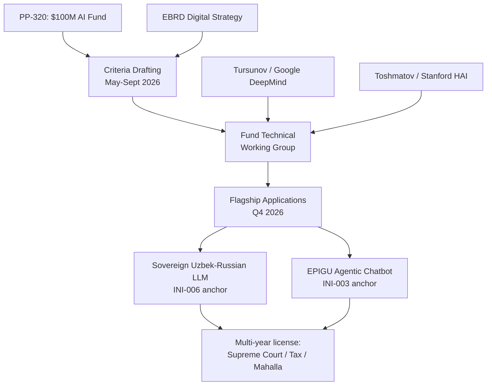

# INI-001 — AI Fund Criteria Co-Design (PP-320)
**Target institution:** National AI Center (AI Center) / Ministry of Digital Technologies (MoDT)
**Target buyer:** Director, National AI Center UZ (Dostonbek Toshmatov — L2_VERIFIED, re-confirm before sending)
**Operational counterpart:** Deputy Minister for Digital Technologies (AI & Innovation)
**Estimated initial contract:** $5,000,000 | **3-year revenue:** $25,000,000
**Scoring:** 9.55 weighted total | Speed 9 | Moat 10 | Defensibility 9 | Capital 10 | CIS Fit 10

---

## Problem (from PP-320, lex.uz/7804404)

Presidential Decree ПП-320, signed 30 October 2025, established a $100,000,000 National AI Project Support Fund to co-finance 50 AI projects through 2028. The Fund's selection criteria are being drafted right now — May through September 2026 — by MoDT under MoEF supervision. No international vendor has yet submitted written input on the evaluation rubric. The window closes in under 90 days.

## Solution

Three-track engagement: (1) Submit a written technical brief on which selection criteria drive measurable national AI capability — specifically: sovereign bilingual LLM readiness, Russian-Uzbek language coverage, government-deployable agentic workflows, UzCloud data residency; (2) Request observer status on the Fund's technical working group via diaspora warm intro; (3) Submit a flagship application in Q4 2026 for a sovereign Uzbek-Russian LLM + EPIGU agentic chatbot, targeted as one of the first three publicly-announced Fund recipients.

## Why This Works in Uzbekistan Now

- **Decree anchor:** PP-320 is 6 months old; Fund operational structure is being set in Q2-Q3 2026 (active window, not hypothetical).
- **Donor co-financing:** EBRD-UZ-DIGITAL-STRATEGY is in active dialogue on UZ AI Strategy — EBRD endorsement of the evaluation rubric is reachable.
- **Competitive vacuum:** Russian vendors (Yandex, MTS AI) are sanctions-shy; Western vendors are slow post-USAID exit; Chinese vendors (Huawei) target infrastructure, not AI applications. This is a genuine empty-field window lasting ≤ 90 days.

## Precedent: UAE Falcon LLM (case-ae-falcon-llm)

UAE's Technology Innovation Institute (TII) built the Falcon LLM anchored by sovereign fund capital. Falcon became the UAE's sovereign AI exporter, deployed across government, banking, and education. **The same structural playbook — sovereign fund + sovereign model + government verticalization — is being executed by PP-320 at UZ scale.** We adapt for Russian-Uzbek bilingual rather than Arabic, and distribute through MoDT/AI Center rather than a standalone research org.

## Scoring Summary

| Axis | Score | Rationale |
|---|---|---|
| Speed to Contract | 9/10 | Criteria-drafting window open May-Sept 2026; Q4 2026 award |
| Strategic Moat | 10/10 | Presidential decree, $100M, no competitor with criteria-shaping access |
| Defensibility | 9/10 | Foundation model + criteria authorship locks downstream verticals |
| Capital Access | 10/10 | $100M state fund + EBRD co-financing pipeline |
| Russian/CIS Fit | 10/10 | Russian-Uzbek bilingual mandatory; sntz.ai stack direct fit |

## The Ask

**First contact:** 20-minute call with AI Center Director to present our technical brief on Fund selection criteria. We bring the Russian-Uzbek bilingual benchmark dataset; they get a citable, independent evaluation framework that strengthens the Fund's credibility with EBRD and international partners.

---

