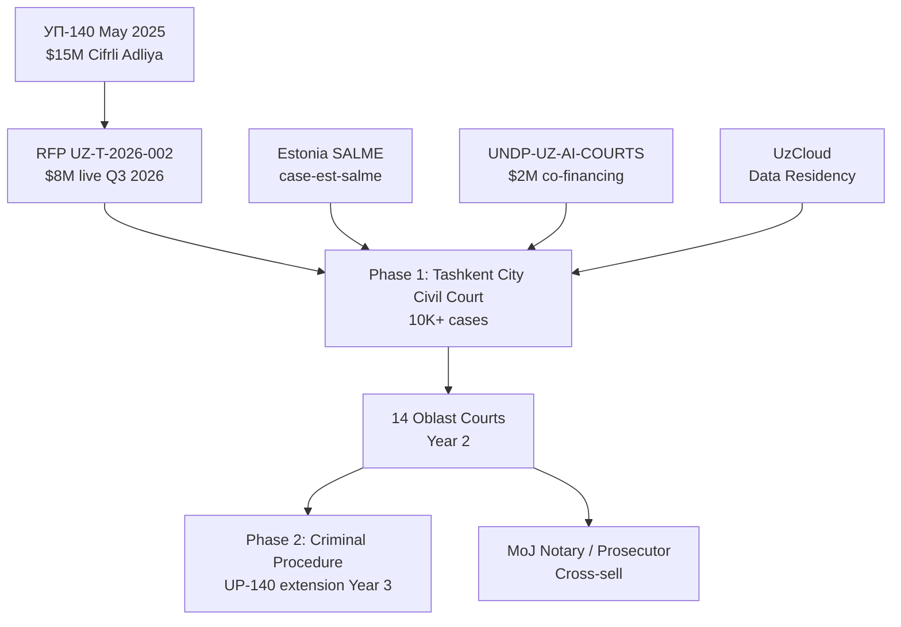

# INI-002 — AI in Courts Phase 1 (UP-140)
**Target institution:** Supreme Court of Uzbekistan
**Target buyer:** Chairman of the Supreme Court, Bahrom Ismoilov
**Operational counterpart:** Head, Digital Court Project (IT Department, Supreme Court)
**Estimated initial contract:** $8,000,000 (live RFP UZ-T-2026-002) | **3-year revenue:** $22,000,000
**Scoring:** 9.40 weighted total | Speed 10 | Moat 9 | Defensibility 9 | Capital 9 | CIS Fit 10

---

## Problem (from UP-140, lex.uz/7696571)

Presidential Decree УП-140 (May 2025) commits the Supreme Court of Uzbekistan to deploy AI in civil-court document analysis, case routing, and judicial-decision support by Q4 2027, with $15,000,000 earmarked from state budget. RFP UZ-T-2026-002 ($8M, AI Document Analysis Pilot — Phase 1) is live with award expected Q3 2026. The Supreme Court's existing case management at Sud.uz is rule-based; the Tashkent City civil court alone processes 150,000+ cases per year and judges spend 40%+ of their time on document review.

**Regulatory note:** UZ-LAW-2026-1125 cited as a PII amendment in earlier research — this law's existence is UNVERIFIED (Correction C-004). The baseline personal-data law UZ-LAW-2019-547 is fully verified and mandates data localization for judicial PII. Pitch anchors on the verified law only.

## Solution

Hybrid AI judicial-support stack adapted from Estonia's SALME (Estonian Supreme Court, 2022–2025):
- Bilingual Uzbek-Russian legal NLP: case classification, statute citation extraction, decision-template suggestion
- Judge-facing workflow assistant: drafts case summaries, flags inconsistencies in pleadings
- Citizen-facing legal aid intake routing (link to UNDP-UZ-AI-COURTS donor co-financing)
- Full deployment on UzCloud — no judicial PII leaves the sovereign boundary

Key differentiator: **triple-script legal corpus** — Uzbek-Cyrillic, Uzbek-Latin, Russian — which no current competitor has demonstrated at production scale.

## Why This Works in Uzbekistan Now

- **Decree anchor:** UP-140 is VERIFIED (lex.uz/7696571), signed May 2025, $15M earmarked.
- **Live RFP:** UZ-T-2026-002 ($8M) is the active procurement vehicle — this is not a future pipeline, it is a live tender.
- **Donor co-financing:** UNDP-UZ-AI-COURTS ($2M) provides co-financing and de-risks the pilot for the Supreme Court.
- **Competitive vacuum:** Havelsan (Turkey) and Soliton (UZ local) are the only visible competitors. Neither has Uzbek-Russian bilingual legal NLP at production scale. Russian vendors (Yandex Court Analyzer) are sanctions-exposed.

## Precedent: Estonian SALME (case-est-salme)

Estonia's SALME (semantic legal analysis engine) has been deployed at the Estonian Supreme Court since 2022. It processes civil-court decisions, generates judge-facing case summaries, and recommends decision templates — in a continental civil-law jurisdiction, exactly as Uzbekistan uses. Estonia's e-Governance Academy (eGA) is the delivery vehicle and can provide an endorsement letter. **Architecture is preserved; Uzbek-Russian triple-script adaptation is the only delta.**

## Scoring Summary

| Axis | Score | Rationale |
|---|---|---|
| Speed to Contract | 10/10 | Live RFP $8M closing Q3 2026 — days, not months |
| Strategic Moat | 9/10 | Presidential decree, bilingual NLP differentiator, < 3 competitors |
| Defensibility | 9/10 | Legal corpus + judge workflow creates deep lock-in |
| Capital Access | 9/10 | $15M state + $2M UNDP co-financing confirmed |
| Russian/CIS Fit | 10/10 | Russian-Uzbek mandatory in judicial proceedings |

## The Ask

Submit pre-qualification documentation for UZ-T-2026-002 by Q2 2026 deadline. Request 30-minute briefing with the Digital Court Project Head (IT Department) to present the SALME comparison brief and Estonia eGA endorsement pathway.

---

