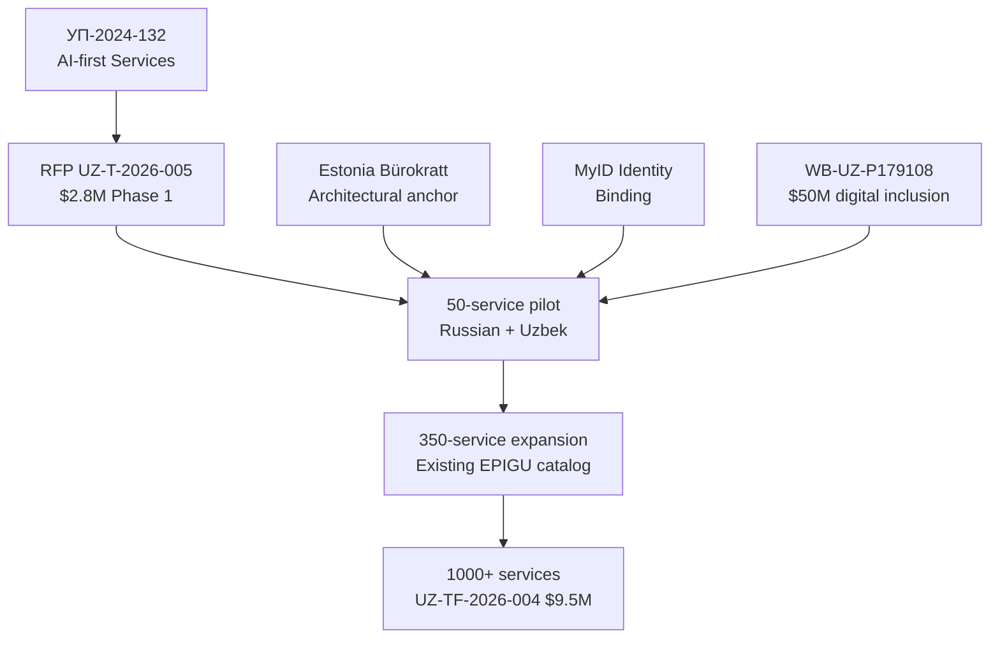

# INI-003 — EPIGU AI Citizen Chatbot
**Target institution:** Public Services Agency UZ / EPIGU
**Target buyer:** Head of EPIGU Product (operational counterpart)
**Decree anchor:** УП-2024-132 (AI-first government services) + ПП-2025-286 (Mahalla digital registry)
**Estimated initial contract:** $2,800,000 (RFP UZ-T-2026-005, tender status INFERRED — verify) | **3-year revenue:** $18,000,000
**Scoring:** 8.80 weighted total | Speed 10 | Moat 8 | Defensibility 8 | Capital 9 | CIS Fit 10

**IMPORTANT CAUTION:** RFP UZ-T-2026-005 ($2.8M) is tagged INFERRED in the audit (Correction C-019). Verify the tender is actually live on etender.uzex.uz before sending this outreach. If the tender is not live, shift strategy to forthcoming UZ-TF-2026-004 ($9.5M, agentic expansion — 2027) and position for early pre-qualification.

---

## Problem (from УП-2024-132, confirmed)

EPIGU (Единый портал государственных услуг Узбекистана) serves 30 million citizens but its existing chatbot is rule-based, Uzbek-only, and covers a small fraction of the 350-service catalog. Citizens wait hours for callback or agent response on routine queries. Estonia's Bürokratt covers 50+ government services for Estonia's 1.3 million citizens and serves as the global reference for government virtual assistant architecture built on open-source, data-sovereign components.

## Solution

Bürokratt-class agentic chatbot stack adapted for EPIGU:
- Russian-Uzbek bilingual conversational layer trained on EPIGU's service taxonomy (50-service pilot → 350 → 1000+)
- X-Road-compatible inter-agency data fetcher using MyID identity verification
- Human-handoff escalation to PSA contact center
- Audit-trail compliance with UZ-LAW-2019-547 data residency
- Full UzCloud deployment — no foreign API calls during production inference

## Why This Works in Uzbekistan Now

- **Decree anchor:** УП-2024-132 commits to AI-first government services — EPIGU is the primary implementation vehicle.
- **Capital:** State budget + WB-UZ-P179108 ($50M digital inclusion co-financing pipeline).
- **Competitive vacuum:** Soliton and Uzinfocom can build rule-based bots, not LLM-grade agentic systems. Yandex/Sber sanctions-exposed.
- **Scale:** 30 million citizens = the largest Russian-Uzbek NLP deployment opportunity in Central Asia.

## Precedent: Estonia Bürokratt (case-et-buerokratt)

Estonia's Bürokratt is the world's reference implementation for a data-sovereign government virtual assistant on open-source components. It handles 50+ government services, integrates with X-Road for inter-agency data fetch, and routes to human agents when intent confidence is low. **We preserve the Bürokratt modular architecture; we adapt the NLP layer for triple-script Uzbek + Russian and integrate with EPIGU's service catalog instead of Estonia's.**

## Scoring Summary

| Axis | Score | Rationale |
|---|---|---|
| Speed to Contract | 10/10 | RFP UZ-T-2026-005 ($2.8M) if confirmed live; $9.5M follow-on |
| Strategic Moat | 8/10 | Presidential decree, clear competitors but none with LLM-grade bilingual |
| Defensibility | 8/10 | MyID binding lock-in; multi-year; citizen adoption network effects |
| Capital Access | 9/10 | State budget + WB $50M co-financing pipeline |
| Russian/CIS Fit | 10/10 | Russian-Uzbek bilingual mandatory; largest CA deployment |

## The Ask

Live demo of Bürokratt-style agentic chatbot on EPIGU's top-10 services (Russian + Uzbek-Latin) — 45 minutes. We bring a working prototype; you evaluate against your existing rule-based bot.

---

