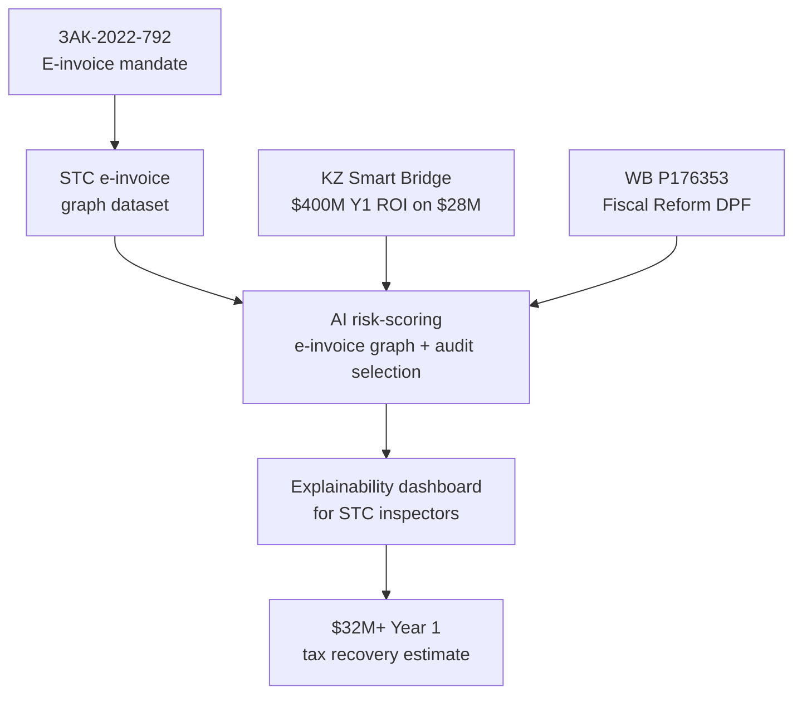

# INI-004 — Tax Risk-Scoring AI for STC (UZ)
**Target institution:** State Tax Committee (GNK) Uzbekistan
**Target buyer:** Chairman, State Tax Committee (GNK)
**Operational counterpart:** Ministry of Finance Digital Finance Department
**Decree anchors:** УЗ-ЗАК-2022-792 (e-invoice), УП-2025-189 (AI 100 projects), ПП-2024-358 (AI Strategy)
**Live tender:** UZ-T-2026-010 ($3,200,000, AI tax fraud risk-scoring) — award expected Q3 2026
**Estimated initial contract:** $3,200,000 | **3-year revenue:** $24,000,000
**Scoring:** 9.05 weighted total | Speed 10 | Moat 9 | Defensibility 8 | Capital 9 | CIS Fit 9

---

## Problem

Uzbekistan's tax gap is estimated at $2B+ annually. Manual audit-selection is unable to keep pace with growing transaction volume. The State Tax Committee mandated e-invoicing since 2022 (УЗ-ЗАК-2022-792), creating a digital transaction trail — but the AI layer to analyze that trail for fraud patterns has not been built. Live tender UZ-T-2026-010 ($3.2M) is the procurement vehicle.

## Solution (anchored on Kazakhstan Smart Bridge)

Kazakhstan Smart Bridge (case-kz-smartbridge-tax) returned $400M in Year 1 tax recovery on a $28M investment. **The same three-layer architecture transfers directly to Uzbekistan:**
1. E-invoice graph anomaly detection: vendor-customer relationship graphs, round-trip fraud flags
2. Audit-selection model trained on STC's historical audit outcomes
3. Explainability dashboard: case-specific rationale for STC inspectors

UZ adaptation: integration with STC's existing e-invoice system (active since 2022), Russian-Uzbek bilingual inspector UX, UzCloud data residency.

## The ROI Pitch

The $28M Kazakhstan investment returned $400M in Year 1 — a 14:1 ROI. At UZ's $3.2M pilot scale and assuming 10% of Kazakhstan's ROI per dollar invested, the conservative Year 1 estimate is $32M in recovered tax revenue from Tashkent pilot alone. This is the language the State Tax Committee Chairman cares about.

## Scoring Summary

| Axis | Score |
|---|---|
| Speed to Contract | 10/10 — live RFP Q3 2026 |
| Strategic Moat | 9/10 — KZ Smart Bridge case study, bilingual UX, no incumbent with AI risk-scoring |
| Defensibility | 8/10 — multi-year, STC integration depth |
| Capital Access | 9/10 — state budget + WB DPF fiscal reform lever |
| CIS Fit | 9/10 — bilingual inspector UX, UzCloud, KZ precedent |

## The Ask

Pre-qualify for UZ-T-2026-010. Request 30-minute briefing with STC Digital Finance Department offering Kazakhstan Smart Bridge case study and live demo of graph anomaly detection on synthetic UZ e-invoice data.

---

