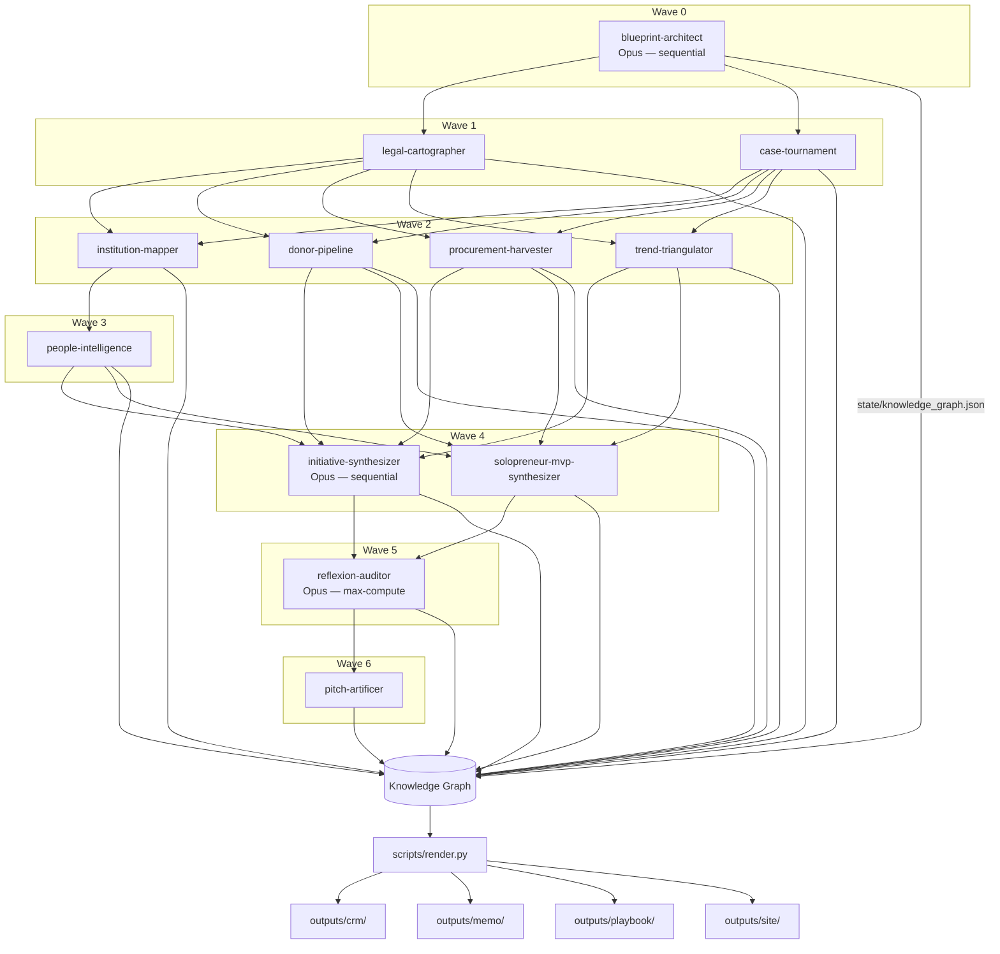

# Developer Experience & Reproducibility Audit
**Auditor role**: #16 — DevEx & Reproducibility specialist
**Date**: 2026-05-03

---

## Repo Navigability Score: 7 / 10

**Justification**

| Dimension | Finding | Score |
|---|---|---|
| 30-second understanding | README lead is good; one paragraph explains the system clearly | + |
| Quickstart path | Exists in QUICKSTART.md but README points only to `make run`; divergence between the two files causes confusion | ~ |
| Architecture diagram | ASCII art in QUICKSTART.md only; Mermaid diagram missing from README | - |
| Issue templates | `.github/ISSUE_TEMPLATE/` directory does not exist | - |
| PR template | `.github/PULL_REQUEST_TEMPLATE.md` does not exist | - |
| CONTRIBUTING.md | Missing entirely | - |
| Code of Conduct | Missing entirely | - |
| CI badges in README | Missing — three workflows exist but none are surfaced | - |
| License badge | Missing | - |
| Citation / BibTeX | Missing | - |
| Release tags | No `v1.0.0` tag; `git tag -l` returns empty | - |
| `state/external/` | Directory exists but README entry reads "OpenRouter evidence cards" with no explanation of the file naming scheme | ~ |
| `state/audit/` | Self-explanatory; `audit_report.md`, `errors.log`, `gaps.md`, `quality_report.json` names are clear | + |
| `.env.example` | Well-commented with rationale per key | + |
| Cost transparency | Stated in QUICKSTART.md (~$70-120) but buried; not in README | ~ |

Deductions: -3 points for missing community files (templates, CONTRIBUTING, CoC) that block any external contribution; these are near-zero-effort additions.

---

## Findings: What breaks on `git clone && make run`

1. **`make run` is opaque without QUICKSTART.md** — README lists `make run` but does not warn it is a ~10 h, ~$70-120 operation. A new user might fire it on a laptop expecting a quick demo.
2. **No CI badge** — passing CI is invisible; contributor trust is missing.
3. **`state/external/` is unexplained** — the directory holds OpenRouter evidence cards (JSON blobs per claim); this purpose needs a README sentence or `state/external/README.md`.
4. **No issue templates** — a journalist or researcher correcting a decree number has no structured path to report it; freeform issues will be missing required fields.
5. **CONTRIBUTING.md absent** — PRs have no guidance on agent spec format, JSON schema compliance, or quality gate requirements.
6. **No versioned release** — `v1.0.0` would let downstream users pin to a known-good knowledge graph snapshot.

---

## README Rewrite Proposal

Full Markdown, ready to commit verbatim as `README.md`. Replaces the current 111-line file. Under 500 lines.

```markdown
# Central Asia B2G Intelligence

[](https://github.com/avaluev/ca-b2g-research/actions/workflows/quality.yml)
[](https://github.com/avaluev/ca-b2g-research/actions/workflows/deploy.yml)
[](https://github.com/avaluev/ca-b2g-research/actions/workflows/link-verify.yml)
[](LICENSE)

A normalized, source-cited knowledge graph of AI and digital government
opportunities in Uzbekistan and Kyrgyzstan. Every claim links to a decree,
an institution, a decision-maker, a donor program, and a global precedent.
Output ships as a public site, an Obsidian vault, CRM-ready CSVs, and a
strategic memo.

**Live site**: https://avaluev.github.io/ca-b2g-research  
**Full run cost**: ~$70–120 (Anthropic API) + up to $20 (OpenRouter, optional)  
**Full run time**: ~10 hours wall-clock  
**Monthly refresh**: ~$15–25, ~4 hours

---

## What you will find

| Output surface | Path | Contents |
|---|---|---|
| CRM CSVs | `outputs/crm/` | 100+ initiatives ranked on 5 axes, decision-maker list |
| Strategic memo | `outputs/memo/strategic_memo.md` | Big-4-style narrative, sector deep-dives, honesty section |
| Operating playbook | `outputs/playbook/` | Per-initiative one-pagers, outreach kits, risk registers |
| Obsidian vault | `outputs/obsidian/` | Linked notes, decree atlas, institution map |
| Public site | `outputs/site/` | HTML + JSON-LD, deployed to GitHub Pages |
| Knowledge graph | `state/knowledge_graph.json` | Merged read view of all 8 record types |
| Evidence trail | `state/external/` | OpenRouter cross-model verification cards (one JSON per claim) |
| Audit logs | `state/audit/` | Quality report, link report, errors log, gap analysis |

---

## Quickstart

Prerequisites: Python 3.10+, [Claude Code CLI](https://claude.ai/code), Git.

```bash
git clone https://github.com/avaluev/ca-b2g-research.git
cd ca-b2g-research
cp .env.example .env          # fill in OPENROUTER_KEY_* if you have them (optional)
make setup                    # installs deps, validates agent specs (~2 min)
```

### Read the outputs without re-running (fastest path)

The committed `state/knowledge_graph.json` and `outputs/` directory contain
the latest research run. To render deliverables from the existing data:

```bash
make render          # CRM CSVs + memo + playbook + Obsidian + site
make check-quality   # 12 content quality gates
make verify-links    # async HEAD-check every URL
```

### Re-run the full pipeline

**Warning**: this costs ~$70–120 in Anthropic API credits and takes ~10 hours.

```bash
make run             # runs all 7 waves (see scripts/run-all.sh)
```

For a wave-by-wave run (recommended for first-timers — see QUICKSTART.md for
the full wave breakdown and per-wave time estimates).

---

## Architecture



**Reasoning sandwich**: Opus at the bookends (Wave 0 strategic planning + Wave 5
adversarial verification), Sonnet on the data-gathering middle. OpenRouter
provides cross-model verification on Tier-A claims (hard $20 cap per run).

**State contract**: agents write to `state/<agent>/output.json`. They read via
`state/knowledge_graph.json` only. `scripts/render.py` writes to `outputs/`.
No agent writes to `outputs/` directly.

---

## Analytical framework

- **5+1 lenses** — Karimov→Mirziyoyev Inversion, Japarov Concentration,
  Decree Half-Life, Donor Co-Financing, Diaspora Bridge, plus Russian/CIS
  Substitution Window. See `docs/lenses.md`.
- **5-axis scoring** — Speed-to-Contract (25%), Strategic Moat (20%),
  Defensibility (20%), Capital Access (20%), Russian/CIS Fit (15%).
  Adjust weights in `state/weights.json`. See `docs/scoring_rubric.md`.
- **8 typed record types** — Decree, Institution, Person, DonorProgram,
  Tender, Trend, GlobalCase, Initiative. Schema at `docs/state_schema.json`.
- **Verification tags** — every claim is `[VERIFIED]`, `[L2_VERIFIED]`,
  `[INFERRED]`, or `[UNVERIFIED]`.

---

## Repo layout

```
ca-b2g-research/
├── .claude/agents/             # 12 agent specifications (Claude Code)
├── .github/workflows/          # CI: quality, deploy, weekly link-verify
├── docs/                       # state_schema.json, lenses.md, scoring_rubric.md
├── scripts/                    # Python/bash pipeline scripts
├── state/
│   ├── blueprint/, cases/, decrees/, donors/,
│   │   institutions/, initiatives/, people/,
│   │   solopreneur_mvps/, tenders/, trends/
│   ├── external/               # OpenRouter cross-model evidence cards
│   ├── audit/                  # quality_report.json, link_report.json,
│   │                           #   audit_report.md, errors.log, gaps.md
│   └── knowledge_graph.json    # merged read view (generated by merge_state.py)
├── outputs/
│   ├── crm/                    # CRM-ready CSVs
│   ├── memo/                   # strategic_memo.md
│   ├── obsidian/               # Obsidian vault
│   ├── playbook/               # per-initiative bundles
│   └── site/                   # HTML site (deployed to GitHub Pages)
├── CLAUDE.md                   # harness policy gateway (read before running)
├── QUICKSTART.md               # full wave-by-wave guide + troubleshooting
├── CONTRIBUTING.md             # how to report errors and submit improvements
├── LICENSE                     # Apache 2.0
├── Makefile                    # primary interface
├── pyproject.toml
└── .env.example                # environment variable template
```

---

## Methodology

Research is treated as infrastructure, not a document. Every claim is typed,
every record carries a verification tag, and every quality gate failure becomes
a regression rule. Source hierarchy is enforced by the harness:

- **Uzbekistan**: lex.uz, gov.uz, president.uz, norma.uz, spot.uz, gazeta.uz, kun.uz
- **Kyrgyzstan**: president.kg, gov.kg, kabmin.kg, cbd.minjust.gov.kg, 24.kg, kaktus.media, akipress.org
- **Donors**: documents.worldbank.org, projects.worldbank.org, adb.org, ec.europa.eu/international-partnerships, undp.org

Every country claim is cross-referenced against at least one Russian-language
source. English-only sourcing fails the quality gate.

---

## Refresh cadence

The knowledge graph is updated monthly. Perishable agents (procurement,
people, donors) re-run first; synthesis and audit follow. The `dateModified`
field in all JSON-LD metadata reflects the last merge timestamp.

---

## Contributing

See [CONTRIBUTING.md](CONTRIBUTING.md) for the full guide. The short version:

- **Data corrections** — use the Research Correction issue template.
- **New regression rules** — open a PR adding a MUST/MUST NOT to the agent
  spec and a corresponding check to `scripts/validate_state.py`.
- **Agent improvements** — fork, run your modified agent against the live
  knowledge graph, include `validate_state.py` output in the PR description.
- **Code of Conduct** — Contributor Covenant v2.1.
  Full text: https://www.contributor-covenant.org/version/2/1/code_of_conduct/

---

## Citing this research

```bibtex
@misc{valuev2026cab2g,
  author       = {Valuev, Alexandr},
  title        = {Central Asia B2G Intelligence: A Multi-Agent Knowledge Graph
                  of AI and Digital Government Opportunities in Uzbekistan
                  and Kyrgyzstan},
  year         = {2026},
  publisher    = {GitHub},
  journal      = {GitHub repository},
  howpublished = {\url{https://github.com/avaluev/ca-b2g-research}},
  note         = {Apache 2.0. Knowledge graph last updated 2026-05}
}
```

---

## License

Apache 2.0 — see [LICENSE](LICENSE).
```

---

## CONTRIBUTING.md Skeleton

Ready to commit verbatim as `CONTRIBUTING.md`.

```markdown
# Contributing

Thank you for helping improve the Central Asia B2G intelligence base.
This harness gets better through use — every correction and every new
regression rule raises the floor for everyone.

## Ways to contribute

| Type | How |
|---|---|
| Data correction | Open a Research Correction issue (template provided) |
| Bug in a script | Open a Bug Report issue (template provided) |
| New regression rule | PR to agent spec + validate_state.py |
| Agent improvement | PR with before/after validate_state.py output |
| New analytical lens | Discuss in an issue first |

## Before you submit a PR

1. Run `make setup` to ensure deps are current.
2. Run `python3 scripts/validate_state.py` — must pass with zero errors.
3. Run `make check-quality` if you changed any `outputs/site/` content.
4. If you modified an agent spec, re-run that agent and include the
   `state/audit/<agent>_*.log` tail in the PR description.
5. Keep PRs focused. One logical change per PR.

## Agent spec format

Agent specs live in `.claude/agents/<agent-name>.md`. Each spec must have:

- **Purpose** — one sentence.
- **Reads** — explicit list of input paths.
- **Writes** — explicit output path (`state/<agent>/output.json`).
- **MUST / MUST NOT** — hard constraints; add new ones when errors occur.
- **Verification requirements** — minimum thresholds per record type.

## JSON schema compliance

All agent output must conform to `docs/state_schema.json`. Run
`python3 scripts/validate_state.py` after every agent run. A schema
violation blocks merge.

## Commit messages

Follow conventional commits: `feat:`, `fix:`, `data:`, `refactor:`,
`docs:`, `ci:`, `chore:`. Use `data:` for knowledge graph updates.

## Code of Conduct

Contributor Covenant v2.1.
https://www.contributor-covenant.org/version/2/1/code_of_conduct/

## Questions

Open a Discussion or email valuev.alexandr@gmail.com.
```

---

## `.github/ISSUE_TEMPLATE/research-correction.md` Skeleton

```markdown
---
name: Research correction
about: A fact, decree number, URL, or person record is incorrect or outdated
title: "[CORRECTION] <record type>: <short description>"
labels: data-correction, needs-triage
assignees: avaluev
---

## What is wrong

**Record type** (Decree / Institution / Person / DonorProgram / Tender / Trend / GlobalCase / Initiative):

**Record ID or field path** (e.g. `state/decrees/uz/output.json > decrees[0].decree_number`):

**Current value in the repo**:

**Correct value**:

## Source for the correction

Link to the primary source (lex.uz, gov.uz, official document, etc.):

Is this source in a language other than English? If so, which language?

## Verification tag you would assign

- [ ] VERIFIED — primary official source confirmed
- [ ] L2_VERIFIED — two independent sources confirmed
- [ ] INFERRED — logical inference, not directly stated
- [ ] UNVERIFIED — suspected but not confirmed

## Additional context

Any other records that are likely affected by this correction:
```

---

## `.github/ISSUE_TEMPLATE/bug-report.md` Skeleton

```markdown
---
name: Bug report
about: A script fails, a Makefile target errors, or validation reports a false positive
title: "[BUG] <short description>"
labels: bug, needs-triage
assignees: avaluev
---

## What happened

**Command run**:
```bash
# paste the exact command
```

**Error output**:
```
# paste the full error message
```

**Expected behavior**:

## Environment

- OS:
- Python version (`python3 --version`):
- Claude Code CLI version (`claude --version`):
- Commit SHA (`git rev-parse --short HEAD`):

## State of the knowledge graph

- `python3 scripts/validate_state.py` output (paste last 20 lines):
- Any recent agent runs that may have produced partial output?

## Possible cause

(Optional) If you have a hypothesis, share it here.
```

---

## `.github/PULL_REQUEST_TEMPLATE.md` Skeleton

```markdown
## What this PR does

<!-- One sentence. Use "fix:", "feat:", "data:", "refactor:", "docs:", "ci:" prefix. -->

## Type of change

- [ ] Data correction (knowledge graph update)
- [ ] Bug fix (script / Makefile / CI)
- [ ] New feature or agent
- [ ] Regression rule addition
- [ ] Documentation only
- [ ] Refactor (no behavior change)

## Checklist

- [ ] `python3 scripts/validate_state.py` passes with zero errors
- [ ] `make check-quality` passes (if `outputs/site/` was touched)
- [ ] Agent spec updated if agent behavior changed
- [ ] New MUST/MUST NOT added to agent spec if fixing an agent error
- [ ] Linked issue (if applicable): closes #

## Evidence (for data corrections and agent runs)

<!-- Paste the last 20 lines of state/audit/<agent>_*.log or validate_state.py output -->

## Source references (for data corrections)

<!-- Link to primary source(s) used to verify the correction -->
```

---

## Citation BibTeX Entry

```bibtex
@misc{valuev2026cab2g,
  author       = {Valuev, Alexandr},
  title        = {Central Asia B2G Intelligence: A Multi-Agent Knowledge Graph
                  of AI and Digital Government Opportunities in Uzbekistan
                  and Kyrgyzstan},
  year         = {2026},
  publisher    = {GitHub},
  journal      = {GitHub repository},
  howpublished = {\url{https://github.com/avaluev/ca-b2g-research}},
  note         = {Apache 2.0. Knowledge graph last updated 2026-05}
}
```

---

## Tag/Release Strategy Proposal

| Tag | Trigger | What it captures |
|---|---|---|
| `v1.0.0` | First complete pipeline run (all waves complete, validate_state passes, < 5% unverified claims) | Baseline knowledge graph; cite-able snapshot |
| `v1.x.0` | Monthly refresh run (minor version for each monthly update) | Updated decrees, people, donors, tenders |
| `v1.x.y` | Patch (script/bug fix, no knowledge graph change) | Code-only fix |
| `v2.0.0` | New country added or schema breaking change | Major architectural evolution |

**Recommended immediate action**: tag current state as `v1.0.0` once
`validate_state.py` passes cleanly.

```bash
git tag -a v1.0.0 -m "First complete pipeline run — Uzbekistan + Kyrgyzstan baseline"
git push origin v1.0.0
```

GitHub Releases (not just tags): create a Release for `v1.0.0` and attach the
`state/knowledge_graph.json` as a downloadable artifact. This lets downstream
users pin to a known-good snapshot without cloning the full repo.

---

## Summary of missing files to create

| File | Priority | Est. effort |
|---|---|---|
| `.github/ISSUE_TEMPLATE/research-correction.md` | High | 10 min |
| `.github/ISSUE_TEMPLATE/bug-report.md` | High | 10 min |
| `.github/PULL_REQUEST_TEMPLATE.md` | High | 10 min |
| `CONTRIBUTING.md` | High | 15 min |
| `README.md` rewrite (with badges + Mermaid) | Medium | 30 min |
| `state/external/README.md` (one paragraph) | Low | 5 min |
| `v1.0.0` git tag + GitHub Release | Low | 5 min |
