# Central Asia B2G — Institutional Org Charts

Generated: 2026-05-04  
Agent: institution-mapper  
Verification: L2_VERIFIED (structures based on official sources + confirmed news)

---

## UZBEKISTAN — Digital/AI Authority Reporting Lines

```mermaid
graph TD
    PRES["🏛 President Mirziyoyev\n[UZ-PRESIDENT]"]
    CAB["Кабинет Министров\n[UZ-CABINET]"]
    COORD["Координационная комиссия\nЦифровой Узбекистан-2030\n[UZ-COORD-COMMISSION-DIGITAL]\n★ HIGHEST LEVERAGE ★"]
    CYBCOORD["Нац. Координационный Совет\nпо Кибербезопасности\n[UZ-NATIONAL-CYBER-COORD-COUNCIL]"]
    AICOMM["Межведомственная комиссия\nпо развитию ИИ\n[UZ-AI-COORD-COMMISSION]\n★ $100M fund criteria ★"]
    ASR["Агентство стратегических\nреформ (АСР)\n[UZ-ASR]"]
    STRATCTR["Центр Стратегия\nРазвития\n[UZ-STRATEGY-CENTER]"]
    SSS["Служба гос.безопасности\n[UZ-STATE-SECURITY]"]
    SCT["Верховный суд\n[UZ-SUPREME-COURT]\n★ УП-140 AI courts ★"]
    PROS["Генпрокуратура\n[UZ-PROSECUTOR]"]
    PUBSVC["Агентство гос.услуг\n[UZ-PUBLIC-SERVICES-AGENCY]\n★ EPIGU/CW-007 ★"]
    NHRC["Нац.Центр прав\nчеловека\n[UZ-NATIONAL-HUMAN-RIGHTS-CENTRE]"]

    PRES --> COORD
    PRES --> CYBCOORD
    PRES --> ASR
    PRES --> STRATCTR
    PRES --> SSS
    PRES --> SCT
    PRES --> PROS
    PRES --> PUBSVC
    PRES --> NHRC
    PRES --> CAB

    CAB --> AICOMM
    
    subgraph MOEF_cluster["МЭФ [UZ-MOEF]"]
        MOEF["Минэкономики и финансов\n[UZ-MOEF]"]
        FRR["ФРР / Фонд\n[UZ-FRR]\n★ $100M AI fund ★"]
        FOF["Фонд фондов\n[UZ-FUND-OF-FUNDS]"]
        CADASTRE["Агентство кадастра\n[UZ-CADASTRE]\n★ $35M WB NSDI ★"]
        TREASURY["Казначейство\n[UZ-TREASURY]"]
    end
    CAB --> MOEF
    MOEF --> FRR --> FOF
    MOEF --> CADASTRE
    MOEF --> TREASURY

    subgraph MINTSIFRY_cluster["МЦТ [UZ-MINTSIFRY]"]
        MINTSIFRY["Министерство цифровых\nтехнологий МЦТ\n[UZ-MINTSIFRY]\n★ LEAD MINISTRY ★"]
        UZINFOCOM["Узинфоком / MyID\n[UZ-UZINFOCOM]"]
        UZCLOUD["UzCloud\n[UZ-UZCLOUD]"]
        DXA["DXA / EPIGU\n[UZ-DXA]"]
        EGOV["E-Gov Center\n[UZ-EGOV-CENTER]"]
        UNICON["UNICON.UZ Кибербез.\n[UZ-UNICON]"]
        AICENTER["Центр развития ИИ\n[UZ-AI-CENTER]\n★ TOR authority ★"]
        MYID["MyID\n[UZ-MYID-OPERATOR]"]
    end
    CAB --> MINTSIFRY
    MINTSIFRY --> UZINFOCOM --> UZCLOUD
    UZINFOCOM --> MYID
    MINTSIFRY --> DXA
    MINTSIFRY --> EGOV
    MINTSIFRY --> UNICON
    MINTSIFRY --> AICENTER

    subgraph MOHESI_cluster["МВО [UZ-MOHESI]"]
        MOHESI["Мин.высш.образования\n[UZ-MOHESI]"]
        INNOAGENCY["Агентство инноваций\n[UZ-NATIONAL-ADVANCED-PROJECTS-AGENCY]"]
        NEWUU["New Uzbekistan University\n[UZ-NEW-UZBEKISTAN-UNIVERSITY]\n★ AI Cluster CW-002 ★"]
    end
    CAB --> MOHESI
    MOHESI --> INNOAGENCY
    MOHESI --> NEWUU

    subgraph Regulators["Регуляторы"]
        CBU["ЦБ Узбекистан\n[UZ-CBU]"]
        GNK["Гос.Налоговый Комитет\n[UZ-GNK]"]
        GTK["Гос.Таможенный Комитет\n[UZ-GTK]"]
        DATAPROT["Орган защиты\nперс.данных\n[UZ-DATA-PROTECTION]"]
        ANTIMON["Антимонопольный\nКомитет\n[UZ-ANTIMONOPOLY]"]
    end
    CAB --> CBU
    CAB --> GNK
    CAB --> GTK
    MINTSIFRY --> DATAPROT
    CAB --> ANTIMON

    ITPARK["IT Park Uzbekistan\n[UZ-IT-PARK]\n★ Market Entry ★"]
    UZTELECOM["Узбектелеком\n[UZ-UZTELECOM]"]
    SPACE["Агентство космич.\nтехнологий\n[UZ-SPACE-AGENCY]"]
    MINTSIFRY --> ITPARK
    MINTSIFRY --> UZTELECOM

    subgraph Donors_UZ["Донорские ПИЕ (Tier 8)"]
        WBDIG["WB Digital Economy PIU\n[UZ-WB-PIU-DIGITAL]"]
        WBCAD["WB NSDI Cadastre PIU\n[UZ-WB-PIU-CADASTRE]\n★ $35M ★"]
        ADBUZ["ADB Digital PIU\n[UZ-ADB-PIU-DIGITAL]"]
        KOICAUZ["KOICA IT Ed PIU\n[UZ-KOICA-PIU]\n★ $14M ★"]
        UNDPUZ["UNDP Digital PIU\n[UZ-UNDP-PIU-DIGITAL]"]
        EUUZ["EU C4CA/GG PIU\n[UZ-EU-PIU-DIGITAL]"]
        JICAUZ["JICA Logistics PIU\n[UZ-JICA-PIU]"]
        GIZUZ["GIZ Governance PIU\n[UZ-GIZ-PIU]"]
    end

    MINTSIFRY -.->|hosts| WBDIG
    CADASTRE -.->|hosts| WBCAD
    MOEF -.->|hosts| ADBUZ
    MOHESI -.->|hosts| KOICAUZ
    MINTSIFRY -.->|hosts| UNDPUZ
    MINTSIFRY -.->|hosts| EUUZ
    MINTRANSPORT["Минтранс\n[UZ-MINTRANSPORT]"] -.->|hosts| JICAUZ
    ASR -.->|hosts| GIZUZ
```

---

## KYRGYZSTAN — Digital/AI Authority Reporting Lines (Post-April 2026)

```mermaid
graph TD
    PRESPRES["🏛 Президент Жапаров\n[KG-PRESIDENT]"]
    UDP["⭐ УДП — Департамент\nцифровой трансформации\n[KG-UDP]\n★ NEW DIGITAL AUTHORITY ★\n★ ALL ROADS LEAD HERE ★"]
    CABINET["Кабинет Министров\n[KG-CABINET]"]
    GKNB["ГКНБ\n[KG-STATE-SECURITY]"]
    PROSKG["Генпрокуратура КР\n[KG-PROSECUTOR]"]
    JK["Жогорку Кенеш\n[KG-JOGORKU-KENESH]"]
    AICOUNCIL["Нац.Совет по ИИ\n[KG-NATIONAL-AI-COUNCIL]\n★ Strategy spec-setter ★"]
    COORDCOMM["Координационный комитет\nцифровой трансформации\n[KG-COORD-COMMITTEE-DIGITAL]"]
    SECREGS["Рабочая группа\nпо подзаконным актам\nЦифрового кодекса\n[KG-AI-SECONDARY-REG-WORKING-GROUP]\n★ CW-010 ★"]

    PRESPRES --> UDP
    PRESPRES --> CABINET
    PRESPRES --> GKNB
    PRESPRES --> PROSKG

    UDP --> AICOUNCIL
    UDP --> COORDCOMM
    UDP --> SECREGS

    MINCIFRY_DISSOLVED["⚠ Минцифры КР\n[KG-MINCIFRY]\nЛИКВИДИРОВАНО ~30.04.2026\nВсе функции → KG-UDP"]
    GKICT_HIST["⚠ ГК ИТС\n[KG-GK-ICT]\nИСТОРИЧЕСКИЙ\n→ Слит в Минцифры"]

    subgraph Tunduk_cluster["Цифровая инфраструктура (под УДП)"]
        TUNDUK["ГУ Тундук / СМЭВ\n[KG-GP-TUNDUK]\n★ 800+ IS connected ★\n★ CW-008 ★"]
        INFOCOM["ГП Инфоком\n[KG-GP-INFOCOM]"]
    end
    UDP -->|transferred Apr-2026| TUNDUK
    UDP -->|transferred Apr-2026| INFOCOM
    INFOCOM --> TUNDUK

    subgraph CABINET_agencies["Агентства/Службы при Кабмине"]
        PROCKG["Департамент гос.закупок\n[KG-PROCUREMENT-DEPT]\n★ zakupki.gov.kg ★"]
        GRS["ГРС — Гос.Регистрация\n[KG-GRS]"]
        STATCOM["Нацстатком\n[KG-NATIONAL-STATCOM]"]
        HTP["Парк Высоких Технологий\n[KG-HTP]"]
        PATENTKG["Кыргызпатент\n[KG-KYRGYZPATENT]"]
        SOCIALFUND["Социальный фонд\n[KG-SOCIAL-FUND]"]
        ANTIMONKG["Антимонопольный орган\n[KG-ANTIMONOPOLY]"]
    end
    CABINET --> PROCKG
    CABINET --> GRS
    CABINET --> STATCOM
    CABINET --> HTP
    CABINET --> PATENTKG
    CABINET --> SOCIALFUND
    CABINET --> ANTIMONKG

    subgraph Regulators_KG["Регуляторы КР"]
        NBKR["Нац.Банк КР (НБКР)\n[KG-NBKR]\n★ CBDC digital som ★\n★ CW-005 ★"]
        FSA["СРНФР / FSA\n[KG-FSA]\n★ USDKG stablecoin ★"]
        GNS["ГНС — Налоговая\n[KG-GNS]"]
        GTS["ГТС — Таможня\n[KG-GTS]"]
    end
    JK --> NBKR
    CABINET --> FSA
    CABINET --> GNS
    CABINET --> GTS

    subgraph Ministries_KG["Отраслевые министерства"]
        MINFIN["Минфин\n[KG-MINFIN]"]
        MINECO["Минэкономики\n[KG-MINECONOMY]"]
        MOJ["Минюст / cbd.minjust.gov.kg\n[KG-MOJ]"]
        MINHEALTH["Минздрав\n[KG-MINHEALTH]"]
        MINEDUC["Минобр\n[KG-MINEDUC]"]
        MINAGRI["Минсельхоз\n[KG-MINAGRI]"]
        MINTRANSKG["Минтранс\n[KG-MINTRANSPORT]"]
        MINENRKG["Минэнерго\n[KG-MINENERGY]"]
        MINLABORKG["Минтруд\n[KG-MINLABOR]"]
    end
    CABINET --> MINFIN
    CABINET --> MINECO
    CABINET --> MOJ
    CABINET --> MINHEALTH
    CABINET --> MINEDUC
    CABINET --> MINAGRI
    CABINET --> MINTRANSKG
    CABINET --> MINENRKG
    CABINET --> MINLABORKG

    subgraph SOEs_KG["SOEs / Телеком"]
        KYRGTELEKOM["Кыргызтелеком\n[KG-KYRGYZTELEKOM]"]
        MEGACOM["MegaCom\n[KG-MEGACOM]"]
        BISHKEKHUB["Бишкекский Цифровой Хаб\n[KG-KYRGYZ-DIGITAL-HUB]"]
    end

    subgraph Donors_KG["Донорские ПИЕ (Tier 8)"]
        WBKG["WB Digital CASA PIU\n[KG-WB-PIU-DIGITAL]\n★ Tunduk CW-008 ★"]
        ADBKG["ADB e-Procurement PIU\n[KG-ADB-PIU-EPROCUREMENT]\n★ 55109-001 ★"]
        EUKG["EU C4CA PIU\n[KG-EU-PIU-C4CA]"]
        GIZKG["GIZ Governance PIU\n[KG-GIZ-PIU-GOVTECH]"]
        UNDPKG["UNDP Digital PIU\n[KG-UNDP-PIU-DIGITAL]"]
        UNDPGOV["UNDP Governance PIU\n[KG-UNDP-PIU-GOVERNANCE]"]
        KOICAKG["KOICA Digital Gov PIU\n[KG-KOICA-PIU]"]
        AKDN["AKDN Mountain Connect. PIU\n[KG-AKDN-PIU]"]
    end
    UDP -.->|hosts| WBKG
    PROCKG -.->|hosts| ADBKG
    UDP -.->|hosts| EUKG
    MOJ -.->|hosts| GIZKG
    UDP -.->|hosts| UNDPKG
    CABINET -.->|hosts| UNDPGOV
    UDP -.->|hosts| KOICAKG
    MINEDUC -.->|hosts| AKDN
```

---

## Key Insight Notes

### Uzbekistan
- **Pre-procurement engagement target (CW-003)**: UZ-AI-COORD-COMMISSION — the body setting $100M fund criteria
- **Fastest entry**: UZ-IT-PARK residency → legal entity → government contracting
- **Gatekeeper**: UZ-UNICON certification required for all state AI system deployments
- **Data layer**: UZ-MYID-OPERATOR — any citizen-facing AI must integrate MyID

### Kyrgyzstan
- **Single most important institution**: KG-UDP — all digital authority concentrated here post-April 2026
- **New TOR window**: KG-UDP is drafting ALL new project TORs (CW-004) — engage NOW
- **Fastest infrastructure entry**: KG-GP-TUNDUK API integration — gives access to 800+ IS
- **CBDC window**: KG-NBKR — wallet, AML, KYC procurement for digital som (CW-005, Jan 2027 target)
- **Procurement gateway**: KG-PROCUREMENT-DEPT / zakupki.gov.kg — all B2G bids start here
