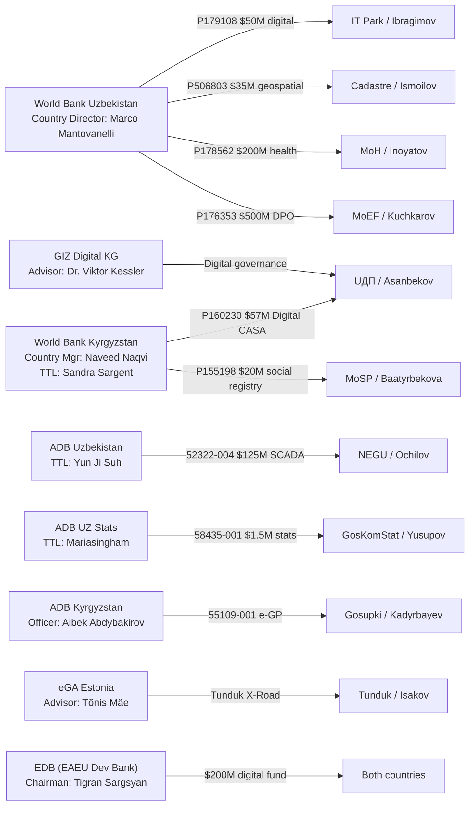
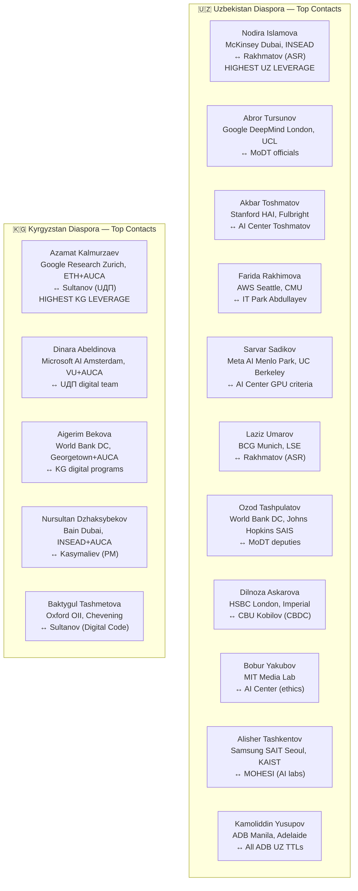

# Network Map — Reporting Lines and Patron Networks
## Central Asia B2G | Mermaid Diagrams | Generated: 2026-05-04

---

## Diagram 1: Uzbekistan Digital Government Reporting Chain

```mermaid
graph TD
    PRES["🇺🇿 President Shavkat Mirziyoyev<br/>uz-mirziyoyev-shavkat<br/>Tier 1"] --> PM
    PRES --> PRESADMIN["Presidential Administration<br/>Chief of Staff: Sardor Umurzakov<br/>uz-president-chief-of-staff<br/>Tier 1"]
    PRES --> ASR["Agency for Strategic Reforms<br/>Director: Bahador Rakhmatov<br/>uz-bahador-rakhmatov<br/>Tier 1 — AI governance policy"]
    PRES --> SUPCT["Supreme Court<br/>Chairman: Bahrom Ismoilov<br/>uz-bahrom-ismoilov<br/>TIER 1 — Digital Court CW-001"]
    PRES --> PUBSVC["Public Services Agency<br/>Head: TBD<br/>EPIGU chatbot CW-007"]

    PM["Prime Minister Abdulla Aripov<br/>uz-abdulla-aripov<br/>Tier 1<br/>Chairs Digital Uzbekistan-2030 Commission"] --> MODT
    PM --> MOEF["MoEF — Ministry Economy & Finance<br/>Minister: Jamshid Kuchkarov<br/>uz-jamshid-kuchkarov<br/>Tier 1 — Controls $100M AI Fund (ПП-320)"]
    PM --> MINZDRAV["Ministry of Health<br/>Minister: Amrillo Inoyatov<br/>uz-amrillo-inoyatov<br/>Tier 1 — $200M WB Health P178562"]
    PM --> MOHESI["Ministry of Higher Ed, Science & Innovation<br/>Minister: Kongratbay Sharipov<br/>uz-kongratbay-sharipov<br/>Tier 1 — 15 university AI labs (УП-189)"]
    PM --> MOJ["Ministry of Justice<br/>Minister: Akbar Tashkulov<br/>uz-akbar-tashkulov<br/>Tier 1 — Digital Court co-responsible"]
    PM --> MVD["Ministry of Internal Affairs<br/>Minister: Pulat Bobojonov<br/>uz-pulat-bobojonov<br/>Tier 1 — Biometric ID, Traffic AI"]
    PM --> MIIT["Ministry of Investments & Trade<br/>Minister: Laziz Kudratov<br/>uz-laziz-kudratov<br/>Tier 1 — FDI for tech sector"]
    PM --> MINENERGY["Ministry of Energy<br/>Minister: Jurabek Mirzamahmudov<br/>uz-jurabek-mirzamahmudov<br/>Tier 1 — $125M ADB SCADA (52322-004)"]

    MODT["Ministry of Digital Technologies<br/>Minister: Sherzod Shermatov<br/>uz-sherzod-shermatov<br/>TIER 1 — HIGHEST LEVERAGE"] --> DEPAI["Deputy Minister AI<br/>uz-mintsifry-dep3<br/>Tier 2"]
    MODT --> DEPINF["Deputy Minister Infrastructure<br/>uz-mintsifry-dep2<br/>Tier 2"]
    MODT --> DEPEG["First Deputy Minister E-Gov<br/>uz-mintsifry-dep1<br/>Tier 2"]
    MODT --> AICENTER["National AI Center<br/>Director: Dostonbek Toshmatov<br/>uz-uzdigital-ai-center-head<br/>Tier 2 — $100M fund technical review"]
    MODT --> ITPARK["IT Park Uzbekistan<br/>CEO: Firdavs Abdullayev<br/>uz-firdavs-abdullayev<br/>Tier 1 — Most accessible official"]
    MODT --> GITS["GITS — State IT Center<br/>uz-gits-head<br/>Tier 2 — Interoperability hub"]
    MODT --> UZINFOCOM["Uzinfocom<br/>uz-cbgov-uzinfocom-head<br/>Tier 2"]
    MODT --> UZCLOUD["UzCloud<br/>uz-egov-uzcloud-head<br/>Tier 3"]
    MODT --> MYID["MyID Platform<br/>uz-myid-head<br/>Tier 2"]
    MODT --> ICTA["ICTA Telecom Regulator<br/>uz-icta-head<br/>Tier 2"]

    MOEF --> CADASTRE["Cadastre Agency<br/>uz-cadastre-director<br/>Tier 2 — $35M WB NSDI P506803 (CW-009)"]
    MOEF --> CBU["Central Bank (CBU)<br/>Chairman: Mamayusuf Kobilov<br/>uz-cbu-governor<br/>Tier 2 — CBDC, open banking"]

    style MODT fill:#ff6b6b,color:#fff
    style ITPARK fill:#ff6b6b,color:#fff
    style AICENTER fill:#ffa726,color:#fff
    style CADASTRE fill:#ffa726,color:#fff
    style SUPCT fill:#ffa726,color:#fff
```

---

## Diagram 2: Kyrgyzstan Digital Government — Japarov Concentration Structure

```mermaid
graph TD
    PRES["🇰🇬 President Sadyr Japarov<br/>kg-sadyr-japarov<br/>Tier 1<br/>Centralized ALL digital authority April 2026"] --> UDP
    PRES --> PM

    UDP["UДП — Presidential Administration<br/>Digital Transformation Dept.<br/>Head: Adilbek Asanbekov<br/>kg-udp-digital-head<br/>TIER 1 — ALL KG DIGITAL PROCUREMENT"] --> SULTANOV["Senior Digital Advisor: Talant Sultanov<br/>kg-talant-sultanov-former<br/>TIER 1 — HIGHEST LEVERAGE CMU/AUCA"]
    UDP --> KOICHUBAEV["Deputy Head Digital: Timur Koichubaev<br/>kg-presidential-digital-dept-dep<br/>Tier 2 — Georgia Tech AI Strategy"]
    UDP --> TUNDUK["State Enterprise Tunduk<br/>Director: Marat Isakov<br/>kg-tunduk-gp-head<br/>Tier 1 — X-Road e-gov backbone"]
    UDP --> AI_COUNCIL["National AI Council<br/>Chair: Azamat Sydykov<br/>kg-national-ai-council-chair<br/>Tier 2"]

    PM["Prime Minister Adylbek Kasymaliev<br/>kg-adylbek-kasymaliev<br/>Tier 1"] --> MINFIN
    PM --> MINECO
    PM --> MINHEALTH
    PM --> MINEDUC
    PM --> MINSOC
    PM --> MOJ_KG
    PM --> GOSUPKI
    PM --> GTS
    PM --> NBKR

    MINFIN["Ministry of Finance<br/>Minister: Almaz Baketaev<br/>kg-almaz-baketaev<br/>Tier 1 — Digital budget, CBDC"]
    MINECO["Ministry of Economy<br/>Minister: Daniyar Amanaliev<br/>kg-mineco-head<br/>Tier 2 — Virtual assets, USDKG"]
    MINHEALTH["Ministry of Health<br/>Minister: Alymkadyr Beishenaliev<br/>kg-minzdrav-head<br/>Tier 1 — E-health + Tunduk"]
    MINEDUC["Ministry of Education<br/>Minister: Dogdurbu Kenzhematova<br/>kg-mineduc-head<br/>Tier 1 — KOICA EdTech"]
    MINSOC["Ministry of Social Protection<br/>Minister: Gulnara Baatyrbekova<br/>kg-minsoc-head<br/>Tier 1 — $20M WB biometric registry"]
    MOJ_KG["Ministry of Justice<br/>Minister: Aida Salyanoba<br/>kg-moj-head<br/>Tier 2 — Digital Code personal data"]
    GOSUPKI["State Procurement Agency<br/>Director: Azamat Kadyrbayev<br/>kg-goszakupki-head<br/>Tier 1 — e-GP platform, ADB 55109"]
    GTS["State Customs Service<br/>Director: Kairat Usenov<br/>kg-gts-head<br/>Tier 1 — ADB customs AI"]
    NBKR["National Bank NBKR<br/>Chairman: Melis Turganbekov<br/>kg-nbkr-head<br/>Tier 1 — CBDC digital som"]

    style UDP fill:#ff6b6b,color:#fff
    style SULTANOV fill:#ff6b6b,color:#fff
    style TUNDUK fill:#ffa726,color:#fff
    style GOSUPKI fill:#ffa726,color:#fff
```

---

## Diagram 3: Donor Counterpart Network — Key Dyads

---

## Diagram 4: Diaspora Bridge Network — Highest-Leverage Contacts

---

## Patron Network (Key political alignments — documented public positions only)

| Official | Patron | Relationship Type |
|---------|--------|-------------------|
| uz-sherzod-shermatov | uz-mirziyoyev-shavkat | Appointed by President 2018; longest-serving digital minister |
| uz-abdulla-aripov | uz-mirziyoyev-shavkat | PM appointed by President; former MITC minister |
| uz-bahador-rakhmatov | uz-mirziyoyev-shavkat | Presidential agency — direct appointment |
| uz-jamshid-kuchkarov | uz-mirziyoyev-shavkat | PM nomination, Presidential approval |
| uz-firdavs-abdullayev | uz-sherzod-shermatov | IT Park reports to MoDT; Abdullayev appointed by Shermatov |
| uz-uzdigital-ai-center-head | uz-mintsifry-dep3 | AI Center under MoDT deputy for AI |
| kg-adylbek-kasymaliev | kg-sadyr-japarov | PM appointed by President Nov 2023 |
| kg-talant-sultanov-former | kg-sadyr-japarov | Digital minister appointed by President; retained post-dissolution |
| kg-udp-digital-head | kg-talant-sultanov-former | UДП deputy reports to Sultanov as senior advisor |
| kg-tunduk-gp-head | kg-talant-sultanov-former | Tunduk GP under former Mintsifry; retained under UДП |
